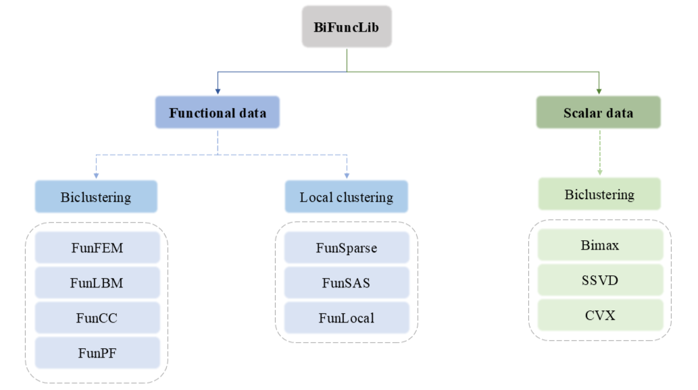

<div align="center">

</div>

[](https://pypi.org/project/GENetLib)

[](https://github.com/XMU-Kuangnan-Fang-Team/GENetLib/actions/workflows/CI.yml/badge.svg)
[](https://codecov.io/github/XMU-Kuangnan-Fang-Team/BiFuncLib)
[](https://opensource.org/licenses/MIT)
[](https://genetlib.readthedocs.io/en/latest/?badge=latest)
[](https://github.com/psf/black)

## `BiFuncLib`:  A Python library for biclustering with functional data
``BiFuncLib`` is a Python package that aggregates multiple biclustering methods.

Our package provides biclustering methods for both functional and scalar data (mainly for functional data). The functional-data approaches are further divided into biclustering and local clustering variants. A small set of scalar-data biclustering algorithms has also been included to ensure the package’s extensibility.

For functional data, in standard biclustering, each sample contains multiple functions, and the algorithm jointly clusters both samples and these functions across the entire dataset. In contrast, local clustering assumes only one function per sample; it segments that single function into local pieces and then performs biclustering on the resulting sub-functions.

## Methods
This package is capable of handling a variety of biclustering methods, by category:
### Functional data (biclustering)
- FunFEM (EM algorithm)
- FunLBM (Latent Block Model)
- FunCC (Cheng and Church)
- FunPF (Penalized Fusion)

### Functional data (local clustering)
- FunSparse (Sparse clustering)
- FunSAS (Sparse And Smooth)
- FunLocal (Local clustering)

### Scalar data
- Bimax (divide-and-conquer algorithm)
- SSVD (Sparse Singular Value Decomposition)
- CVX (ConVeX biclustering)

BiFuncLib unifies these approaches into a comprehensive and easily extensible biclustering toolkit. The framework is shown below.

<div align="center">

</div>

We provide a web-based documentation which introduces the meaning of function parameters, the usage of functions, detailed information about methods, and gives examples for each. The web page is available at
[documentations](https://open-box.readthedocs.io/en/latest/).
This package has been uploaded to PyPI with previous versions, and the web page is available at
[PyPI package](https://pypi.org/project/genetlib/). Users can also check [releases](https://github.com/XMU-Kuangnan-Fang-Team/BiFuncLib/releases) to get historical versions.

## Installation
It is recommended to use ``pip`` for installation:
```c
pip install BiFuncLib
```
To get further information about installation and independencies, please move to [installation instructions](https://genetlib.readthedocs.io/en/latest/installation.html).

## Quick Start
Below are individual usage examples for each method, including computational results and plots (where applicable).
### FunFEM
``fem_bifunc`` performs FunFEM algorithm which allows to cluster functional data by modeling the curves within a common and discriminative functional subspace.
```Python
from BiFuncLib.fem_bifunc import fem_bifunc
from BiFuncLib.simulation_data import fem_sim_data
from BiFuncLib.BsplineFunc import BsplineFunc
from GENetLib.fda_func import create_fourier_basis
basis = create_fourier_basis((0, 181), nbasis=25)
time_grid = np.arange(1, 182).tolist()
fem_simdata = fem_sim_data()
fdobj = BsplineFunc(basis).smooth_basis(time_grid, np.array(fem_simdata['data'].T))['fd']
fem_res = fem_bifunc(fdobj, K=[6], model=['AkjBk'], init='kmeans', lambda_=0, disp=True)
FDPlot(fem_res).fem_fdplot(fem_simdata, fdobj)
```
### FunLBM
`lbm_bifunc` performs FunLBM algorithm which is a model-based co-clustering method for large-scale functional data that simultaneously clusters rows and columns by fitting a latent block model where each block is represented by a low-dimensional functional subspace.
```python
from BiFuncLib.simulation_data import lbm_sim_data
from BiFuncLib.lbm_bifunc import lbm_bifunc
from BiFuncLib.lbm_main_func import ari
lbm_simdata1 = lbm_sim_data(n = 100, p = 100, t = 30, seed = 1)
data1 = lbm_simdata1['data']
lbm_res = lbm_bifunc(data1, K=4, L=3)
FDPlot(lbm_res).lbm_fdplot('proportions')
print(ari(lbm_res['col_clust'],lbm_simdata1['col_clust']))
print(ari(lbm_res['row_clust'],lbm_simdata1['row_clust']))
```
### FunCC
`cc_bifunc` performs FunCC, a non-parametric, non-exhaustive functional bi-clustering algorithm that extends the Cheng–Church framework; it simultaneously identifies row–column subsets of curves by minimizing an H-score and optionally aligns them with domain shifts, all without distributional assumptions. 

`cc_bifunc_cv` provides a function for finding the best tunning.

```python
from BiFuncLib.simulation_data import cc_sim_data
from BiFuncLib.cc_bifunc import cc_bifunc, cc_bifunc_cv
delta_list = np.linspace(0.1, 20, num = 21)
fun_mat = cc_sim_data()
cc_result_cv = cc_bifunc_cv(fun_mat, delta_list = delta_list, alpha = 1, beta = 0, const_alpha = True)
cc_result = cc_bifunc(fun_mat, delta = 10, alpha = 1, beta = 0, const_alpha = True, shift_alignment = False)
FDPlot(cc_result).cc_fdplot(fun_mat, only_mean = True, aligned = False, warping = False)
```

### FunPF
`pf_bifunc` performs FunPF, which is a penalized-fusion biclustering approach for functional data that combines a smoothness penalty for curve estimation with a fusion penalty on coefficient differences, enabling simultaneous and consistent identification of row and column clusters without assuming any generative model.
```python
from BiFuncLib.pf_bifunc import pf_bifunc
from BiFuncLib.simulation_data import pf_sim_data
pf_simdata = pf_sim_data(n = 60, T = 10, nknots = 3, order = 3, seed = 123)['data']
pf_result = pf_bifunc(pf_simdata, nknots = 3, order = 3, gamma1 = 0.023, gamma2 = 3, 
                      theta = 1, tau = 3, max_iter = 500, eps_abs = 1e-3, eps_rel = 1e-3)
FDPlot(pf_result).pf_fdplot()
```


For more information about the functions and methods, please check [main functions](https://genetlib.readthedocs.io/en/latest/main%20functions/main%20functions.html#).

## Reference
The main referenced papers of these methods are:
### FunFEM
Bouveyron C, Côme E, Jacques J. The discriminative functional mixture model for the analysis of bike sharing systems[J]. Preprint HAL, 2014 (01024186).
### FunLBM
Bouveyron C, Bozzi L, Jacques J, et al. The functional latent block model for the co-clustering of electricity consumption curves[J]. Journal of the Royal Statistical Society Series C: Applied Statistics, 2018, 67(4): 897-915.
### FunCC
Galvani M, Torti A, Menafoglio A, et al. FunCC: A new bi-clustering algorithm for functional data with misalignment[J]. Computational Statistics & Data Analysis, 2021, 160: 107219.
### FunPF
Fang K, Chen Y, Ma S, et al. Biclustering analysis of functionals via penalized fusion[J]. Journal of multivariate analysis, 2022, 189: 104874.
### FunSparse
Floriello D, Vitelli V. Sparse clustering of functional data[J]. Journal of Multivariate Analysis, 2017, 154: 1-18.
### FunSAS
Centofanti F, Lepore A, Palumbo B. Sparse and smooth functional data clustering[J]. Statistical Papers, 2024, 65(2): 795-825.
### FunLocal
Chen Y, Zhang Q, Ma S. Local clustering for functional data[J]. Journal of Computational and Graphical Statistics, 2025: 1-16.
### Bimax
Prelić A, Bleuler S, Zimmermann P, et al. A systematic comparison and evaluation of biclustering methods for gene expression data[J]. Bioinformatics, 2006, 22(9): 1122-1129.
### SSVD
Lee M, Shen H, Huang J Z, et al. Biclustering via sparse singular value decomposition[J]. Biometrics, 2010, 66(4): 1087-1095.
### CVX 
Chi E C, Allen G I, Baraniuk R G. Convex biclustering[J]. Biometrics, 2017, 73(1): 10-19.

Other referenced papers can be obtained in [references](https://genetlib.readthedocs.io/en/latest/references.html).

## License
BiFuncLib is licensed under the MIT License. See [LICENSE](https://github.com/XMU-Kuangnan-Fang-Team/BiFuncLib/blob/main/LICENSE) for details.

## Feedback
- Welcome to submit [issues](https://github.com/XMU-Kuangnan-Fang-Team/BiFuncLib/issues) or [pull requests](https://github.com/XMU-Kuangnan-Fang-Team/BiFuncLib/pulls).
- Send an email to Barry57@163.com to contact us.
- Thanks for all the supports! 👏

