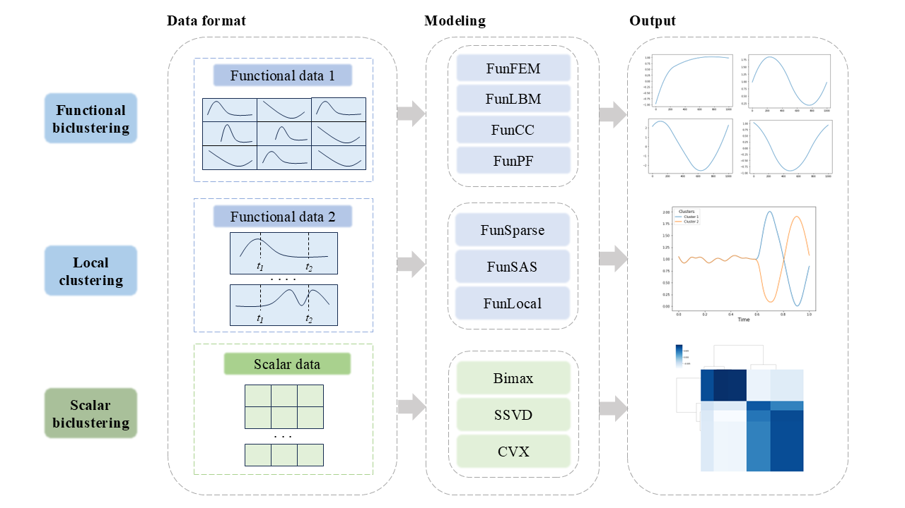

introduction
=========================

.. image:: _static/BiFuncLib_label.png
   :width: 700
   :align: center

.. image:: https://img.shields.io/pypi/v/BiFuncLib?logo=Pypi
   :target: https://pypi.org/project/BiFuncLib
.. image:: https://img.shields.io/badge/Python-3.8%2B-lightblue.svg
.. image:: https://github.com/XMU-Kuangnan-Fang-Team/BiFuncLib/actions/workflows/CI.yml/badge.svg
   :target: https://github.com/XMU-Kuangnan-Fang-Team/BiFuncLib/actions/workflows/CI.yml/badge.svg
.. image:: https://codecov.io/github/XMU-Kuangnan-Fang-Team/BiFuncLib/graph/badge.svg?token=9J9QMN7L9Z
   :target: https://codecov.io/github/XMU-Kuangnan-Fang-Team/BiFuncLib
.. image:: https://img.shields.io/badge/License-MIT-darkgreen.svg
   :target: https://opensource.org/licenses/MIT
.. image:: https://readthedocs.org/projects/bifunclib/badge/?version=latest
    :target: https://bifunclib.readthedocs.io/en/latest/?badge=latest
.. image:: https://img.shields.io/badge/code%20style-black-000000.svg
   :target: https://github.com/psf/black

**BiFuncLib** is a Python package that aggregates multiple biclustering methods.

Package Design
---------------

Our package provides biclustering methods for both functional and scalar data (mainly for functional data). The functional-data approaches are further divided into biclustering and local clustering variants. A small set of scalar-data biclustering algorithms has also been included to ensure the package’s extensibility.

For functional data, in standard biclustering, each sample contains multiple functions, and the algorithm jointly clusters both samples and these functions across the entire dataset. In contrast, local clustering assumes only one function per sample; it segments that single function into local pieces and then performs biclustering on the resulting sub-functions.

Workflow
---------------

The workflow of **BiFuncLib** is shown in the figure below.

BiFuncLib adopts a unified architecture that encompasses multiple algorithmic implementations. It processes data through modules for preprocessing, modeling, and visualization. Functional data are spline-processed for flexible analysis and easy integration of new methods, branching into functional and local clustering. Scalar data are processed directly by scalar biclustering methods. All outputs include quantitative results and plots, ensuring every method in the package is accompanied by a reproducible and visually interpretable output.

Features
-----------

**BiFuncLib** has the following features:

- **Unified Workflow**: Every implemented algorithm is accompanied by dedicated modules for simulation data generation, functional data preprocessing, model construction, and visualization, ensuring methodological consistency and ease of use.

- **Convenient Functional Data Handling**: BiFuncLib extends Python’s functional data analysis capabilities by offering a rich set of computational tools, including spline-based representations, to facilitate the integration of new functional clustering methods into the framework.

- **Code Reliability and Reproducibility**: All algorithms in BiFuncLib have been rigorously tested to confirm consistency with the results reported in their original publications. The package includes complete, ready-to-run code examples to reproduce published results and simulation studies.
